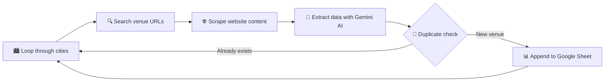

<div align="center">

# 🏛️ Pakistan Event Venue Lead Generator 🎉

### Automated lead generation for marriage halls, marquees, and event lounges across Pakistan 🇵🇰


<br/>


<br/>

[](https://github.com/AbdulAzeemHashmi/pakistan-event-venue-lead-generator/stargazers)
[](https://github.com/AbdulAzeemHashmi/pakistan-event-venue-lead-generator/network/members)
[](https://github.com/AbdulAzeemHashmi/pakistan-event-venue-lead-generator/issues)

</div>

<br/>

## 📖 Overview

This tool automates the process of finding event venues in Pakistan, extracting their contact information, and storing it in a Google Sheet. It uses AI (Google Gemini) to extract structured data from website content and Google Apps Script for free spreadsheet integration.

<br/>

## ✨ Features

| Feature | Description |
|---|---|
| 🔍 | Search for marriage halls, marquees, and event lounges across multiple Pakistani cities |
| 📇 | Extract venue details including name, address, phone, WhatsApp, email, and contact form URL |
| 📊 | Append data directly to Google Sheets |
| 🧹 | Duplicate detection to avoid adding the same venue twice |
| 🤖 | AI powered data extraction using Google Gemini |
| 🆓 | Completely free to use, no credit card required |

<br/>

## 🛠️ Tech Stack

<div align="center">


</div>

<br/>

## ✅ Prerequisites

Before you begin, make sure you have the following ready:

- 🐍 Python 3.10 or higher installed
- 🔑 Google Gemini API key (free from Google AI Studio)
- 📧 A Google account for Google Sheets
- 💻 Basic knowledge of the command line

<br/>

## 🚀 Installation

### 1️⃣ Clone the Repository

```bash
git clone https://github.com/AbdulAzeemHashmi/pakistan-event-venue-lead-generator.git
cd pakistan-event-venue-lead-generator
```

### 2️⃣ Create a Virtual Environment

```bash
# Windows
python -m venv .venv
.venv\Scripts\activate

# Linux / Mac
python3 -m venv .venv
source .venv/bin/activate
```

### 3️⃣ Install Dependencies

```bash
pip install -r requirements.txt
```

### 4️⃣ Configure Environment Variables

Copy the example environment file:

```bash
copy .env.example .env
```

Open `.env` and fill in your API keys:

```
GEMINI_API_KEY=your_gemini_api_key_here
CITIES=Karachi,Lahore,Islamabad,Rawalpindi,Faisalabad,Multan,Quetta,Peshawar
```

### 5️⃣ Set Up Google Sheets Integration

<details>
<summary>🅰️ Option A: Google Apps Script Web App (Recommended, 100% Free) 🆓</summary>

<br/>

1. Open your Google Sheet 📄
2. Go to Extensions then Apps Script
3. Delete the default code and paste this:

```javascript
function doPost(e) {
  try {
    const sheet = SpreadsheetApp.getActiveSpreadsheet().getActiveSheet();
    const data = JSON.parse(e.postData.contents);
    sheet.appendRow(data);
    return ContentService
      .createTextOutput(JSON.stringify({ success: true }))
      .setMimeType(ContentService.MimeType.JSON);
  } catch (error) {
    return ContentService
      .createTextOutput(JSON.stringify({ success: false, error: error.toString() }))
      .setMimeType(ContentService.MimeType.JSON);
  }
}

function doGet(e) {
  const sheet = SpreadsheetApp.getActiveSpreadsheet().getActiveSheet();
  const data = sheet.getDataRange().getValues();
  const headers = data[0];
  const rows = data.slice(1).map(row => {
    const obj = {};
    headers.forEach((header, i) => {
      obj[header] = row[i] || "";
    });
    return obj;
  });
  return ContentService
    .createTextOutput(JSON.stringify(rows))
    .setMimeType(ContentService.MimeType.JSON);
}
```

4. Click Deploy, then New Deployment, then Web App
5. Execute as: Me
6. Who has access: Anyone
7. Copy the deployment URL 🔗
8. Update `src/sheet_handler.py` with your URL:

```python
self.webapp_url = "YOUR_DEPLOYMENT_URL_HERE"
```

</details>

<details>
<summary>🅱️ Option B: Service Account (Traditional Method) 🔐</summary>

<br/>

1. Enable Google Sheets API in Google Cloud Console
2. Create a service account and download the JSON key
3. Place `service_account.json` in the project root
4. Share your spreadsheet with the service account email

</details>

<br/>

## ▶️ Usage

### Run the Automation

```bash
python main.py
```

The script will:

1. 🔁 Loop through each city in your configuration
2. 🔍 Search for venues (marriage halls, marquees, event lounges)
3. 🤖 Extract data using Gemini AI
4. 🧹 Check for duplicates
5. 📥 Append valid entries to your Google Sheet

<br/>



<br/>

### 🌆 Customize Cities

Edit the `CITIES` variable in your `.env` file:

```
CITIES=Karachi,Lahore,Islamabad,Rawalpindi,Faisalabad,Multan,Quetta,Peshawar
```

### 🔢 Customize Number of Results

In `main.py`, modify the `num_results` parameter:

```python
urls = search.get_venue_urls(query, num_results=10)  # Default is 5
```

<br/>

## 📁 Project Structure

```
pakistan-event-venue-lead-generator/
├── src/
│   ├── __init__.py
│   ├── ai_handler.py       # Gemini API integration 🤖
│   ├── search_handler.py   # Web search and scraping 🔍
│   ├── sheet_handler.py    # Google Sheets integration 📊
│   └── utils.py            # Helper functions 🧰
├── .env                    # Environment variables (ignored by git) 🔒
├── .env.example            # Example environment file
├── .gitignore              # Git ignore rules
├── config.py               # Configuration management ⚙️
├── main.py                 # Main entry point 🚀
├── README.md               # Project documentation 📖
└── requirements.txt        # Python dependencies 📦
```

<br/>

## 🧬 Data Extraction

The AI extracts the following fields from venue websites:

| Field | Description |
|---|---|
| 🏷️ Name | Venue name |
| 📍 Address | Physical address |
| ☎️ Phone | Contact phone number |
| 💬 WhatsApp | WhatsApp number (if available) |
| 📧 Email | Email address (if available) |
| 📝 ContactForm | Contact form URL (if available) |

These fields are then mapped to the 15 columns in your Google Sheet:

```
Name | Address | Phone | WhatsApp | Mail Address | Contact us Form | Service to pitch | Contacted | Instructions | Follow up 1 | Follow up 1 Instructions | Follow up 2 | Follow up 2 Instructions | UPDATE | CLIENT CLOSED
```

<br/>

## 🩹 Troubleshooting

<details>
<summary>🚫 <code>service_account.json</code> file appears in git status</summary>

<br/>

Your `.gitignore` is not correctly ignoring the file. Update it with:

```gitignore
**/service_account.json
```

</details>

<details>
<summary>🔑 Google Sheets API returns an authentication error</summary>

<br/>

Ensure the following:

- Your service account email has Editor access to the spreadsheet
- The `service_account.json` file is in the correct location
- Google Sheets API is enabled

</details>

<details>
<summary>🕳️ No venues found</summary>

<br/>

Try the following:

- Increase the `num_results` parameter
- Check your internet connection
- Verify the search queries in `config.py`
- Try different cities or venue types

</details>

<details>
<summary>🤷 Gemini extraction returns empty data</summary>

<br/>

- Check your Gemini API key is valid
- Ensure you have available API credits
- Verify the website HTML is accessible

</details>

<br/>

## 💸 Cost Considerations

This project is designed to be completely free:

- 🤖 Google Gemini API: free tier available (60 requests per minute)
- 📊 Google Sheets API: free with generous rate limits
- 🌐 Web scraping: uses free methods, no paid APIs
- ⚙️ Google Apps Script: 100% free

No credit card is required for the Apps Script integration method.

<br/>

## 🤝 Contributing

Contributions are welcome! Please feel free to submit a Pull Request. 🙌

<br/>

## 📬 Contact

<div align="center">

For questions or support, please open an issue on GitHub, or reach out directly.

[](https://github.com/AbdulAzeemHashmi)
[](https://abdulazeemhashmi.vercel.app/)
[](mailto:abdulazeem7982@gmail.com)

</div>

<br/>

<div align="center">

### 🎊 Happy lead generation! 🎊

⭐ If this project helped you, consider giving it a star on GitHub! ⭐

</div>